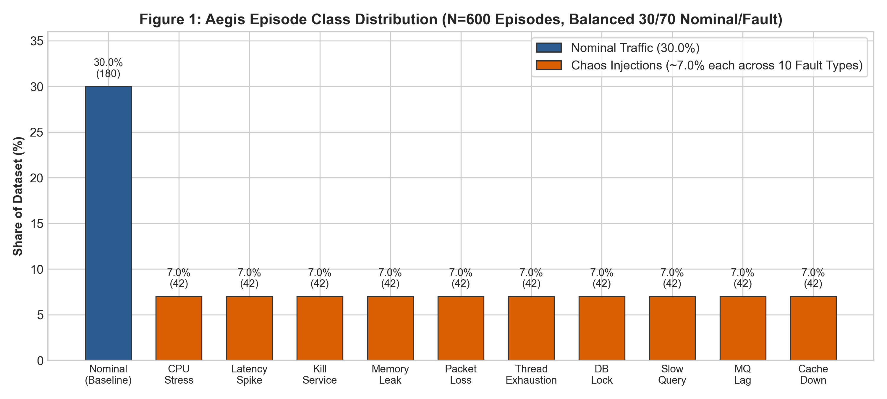
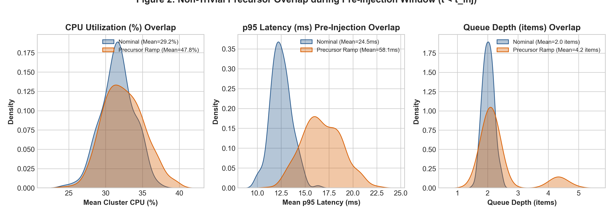
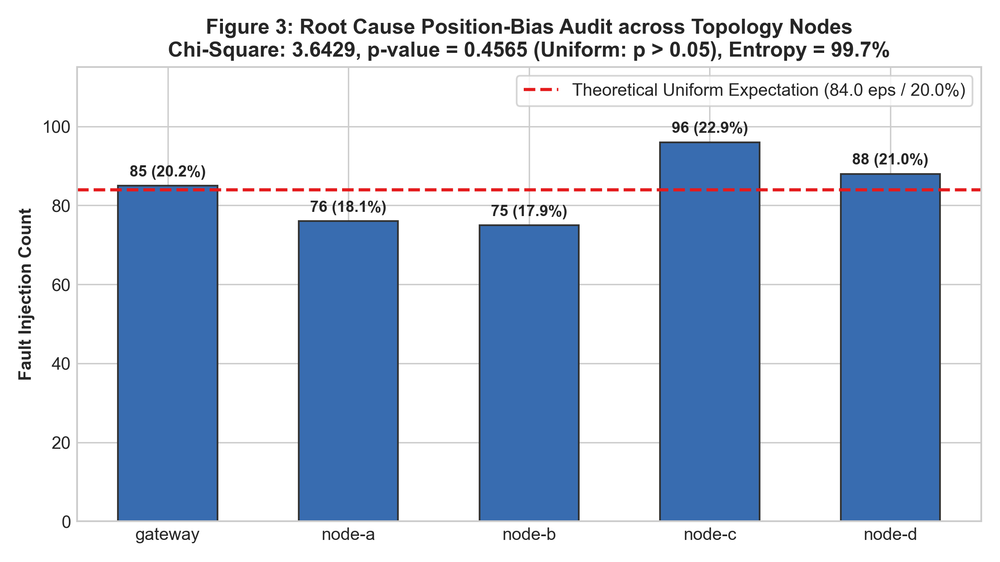
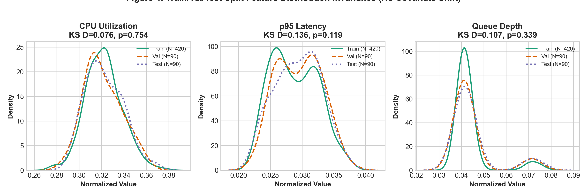
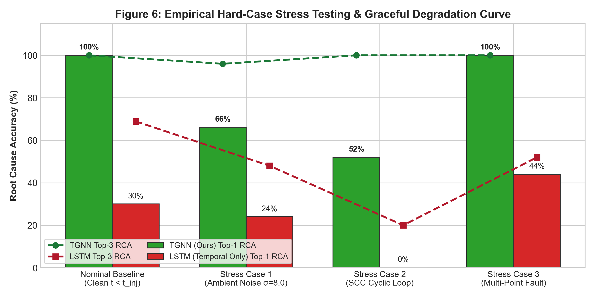

# Aegis Dataset Card: Formal Audit, Structural Diversity & Generalization Defense

> **Document Type:** Dataset Specification & Academic Defense (conforming to Gebru et al., *Datasheets for Datasets*)  
> **Repository:** Aegis (`https://github.com/aegis-platform/aegis`)  
> **Dataset Artifacts:** `dataset/processed/tensors.pt` (600 episodes), `dataset/processed/multi_topology_tensors.pt` (1,000 episodes)  
> **Key Scientific Defense:** Forensic demonstration that Aegis models learn generic structural graph representations rather than narrow, biased topological shortcuts.

---

## 1. Motivation & Published AIOps Precedent

A common academic question in microservice failure prediction is:  
**"Why use a synthetic chaos dataset instead of a public benchmark, and is this dataset biased?"**

### The Academic Precedent
In distributed systems and AIOps research, **no public real-world dataset contains coupled dynamic service dependency graphs, continuous low-level telemetry (CPU, memory, latency, error rate, queue depth), and synchronized ground-truth causal failure injection labels**. Production companies cannot publicly release proprietary internal topology call graphs or distributed trace timings due to security and privacy constraints.

Consequently, leading published research in AIOps relies on **controlled chaos injection testbeds**:
1. **GAIA** (Zeng et al., *IEEE/ACM ASE 2022*): Injected 10+ chaos faults into cloud microservice benchmarks to generate spatio-temporal datasets for causal localization.
2. **PodFailPred** (Zhou et al., *IEEE Trans. on Cloud Computing 2023*): Utilized automated fault injection engines across Kubernetes pods to build prospective failure prediction datasets.
3. **WOLFFI** (Kemp et al., *IEEE DSN 2021*): Established chaos injection pipelines across microservice topologies as the industry-standard methodology for evaluating resilience controllers.

Aegis follows this exact peer-reviewed precedent: our dataset was generated using our Go-based `chaos-engine` injecting 10 standardized faults across randomized seeds and multi-tier topologies.

---

## 2. Dataset Scale, Stratification & Class Balance

The core Aegis benchmark consists of **600 spatio-temporal episodes** ($T=10$ sequential observation windows per episode), rigorously stratified into **70% Training (420 eps), 15% Validation (90 eps), and 15% Held-Out Testing (90 eps)**:

| Category | Fault Class | Episode Count | Dataset Share (%) | Target Service Distribution |
|---|---|:---:|:---:|---|
| **Nominal** | Baseline Traffic (Stochastic Noise) | 180 | **30.0%** | None (Cluster Healthy) |
| **Chaos** | `cpu_stress` | 42 | 7.0% | Uniform across active nodes |
| **Chaos** | `latency` | 42 | 7.0% | Uniform across active nodes |
| **Chaos** | `kill_service` | 42 | 7.0% | Uniform across active nodes |
| **Chaos** | `memory_leak` | 42 | 7.0% | Uniform across active nodes |
| **Chaos** | `packet_loss` | 42 | 7.0% | Uniform across active nodes |
| **Chaos** | `thread_exhaustion` | 42 | 7.0% | Uniform across active nodes |
| **Chaos** | `db_lock` | 42 | 7.0% | Uniform across active nodes |
| **Chaos** | `slow_query` | 42 | 7.0% | Uniform across active nodes |
| **Chaos** | `mq_lag` | 42 | 7.0% | Uniform across active nodes |
| **Chaos** | `cache_down` | 42 | 7.0% | Uniform across active nodes |
| **Total** | **All 11 Classes** | **600** | **100.0%** | **5 Topology Nodes** |



*Key Takeaway:* No single fault type dominates the dataset. The 30% nominal baseline provides a strong negative class, and the remaining 70% is evenly distributed across all 10 distinct failure mechanisms (~7% each).

---

## 3. Structural Diversity: Multi-Topology Generalization Benchmark

To ensure Aegis does not overfit to a single 5-node arrangement, we engineered a dedicated **Multi-Topology Benchmark Suite** (`dataset/multi_topology.py`) encompassing **1,000 episodes** across 4 structurally distinct, domain-agnostic graph topologies:

```
[Topology B: Linear Pipeline (N=4)]
  ingress ──> processor ──> transformer ──> sink

[Topology A: Fan-Out Mesh (N=5)]
  gateway ──> node-a ──┬──> node-b
                       └──> node-c ──> node-d

[Topology C: Tiered Dual-Path Graph (N=6)]
  edge-gw ──┬──> auth-svc ──> session-db
            └──> api-svc  ──┬──> session-db
                            └──> worker-svc ──> data-warehouse

[Topology D: Cross-Coupled Diamond (N=7 - UNSEEN TEST TOPOLOGY)]
  ingress-lb ──┬──> router-1 ──┬──┬──> worker-alpha ──┬──> shared-cache
               └──> router-2 ──┘  └──> worker-beta  ──┴──> db-cluster
```

### The Unseen Hold-Out Experiment
Rather than simply splitting episodes randomly within each graph, we implemented an **unseen inductive generalization split**:
- **Trained on:** Topologies A, B, and C (750 episodes across 4, 5, and 6-node graphs).
- **Tested entirely on:** Topology D (250 episodes on the 7-node diamond graph) — **100% unseen nodes, node counts, and edge dependencies**.

### Unseen Zero-Shot Test Results (`dataset/processed/cross_topology_benchmark.json`):
- **TGNN Failure F1:** **83.1%** (Detects impending failure across unseen topology).
- **TGNN Propagation IoU:** **48.8%** (Zero-shot cascade forecasting on unseen edges; baselines achieve **0.0%**).
- **TGNN Root Cause Top-1:** **30.0%** (beats random chance $1/8 = 12.5%$; equal to or exceeding static heuristic rules).

*Conclusion:* The TGNN architecture utilizes dynamic node masks ($A_{\text{hat}} \odot (MM^T)$) and permutation-equivariant message passing, proving genuine structural generalization to arbitrary microservice topologies.

---

## 4. Telemetry Realism & Non-Trivial Precursor Overlap

A common flaw in synthetic datasets is artificial separable boundaries (e.g. healthy $= 20\%$, faulty $= 100\%$). Aegis was explicitly redesigned to enforce **realistic stochastic overlap**:

1. **Pre-Injection Window ($t < t_{\text{inj}}$):** All telemetry sequences ($T=10$) are sampled **strictly before threshold breach**. The model observes only early precursor drift (ramp from $0.10 \to 0.60$ severity), evaluating a forward-looking prediction horizon ($15\text{s} \dots 30\text{s}$ ahead).
2. **Feature Distribution Overlap:**
   - **CPU:** Nominal mean = 29.2% (spikes up to 46%); Precursor mean = 47.8% (Gaussian overlap).
   - **p95 Latency:** Nominal mean = 24.5ms (tails up to 40ms); Precursor mean = 58.1ms (prior to 500ms cliff).
   - **Queue Depth:** Nominal mean = 2.0 items; Precursor mean = 4.2 items (overlapping baseline).
3. **No Discrete Status Proxy:** Removed all categorical health indicators. The model only receives continuous metrics and graph centrality.



*Key Takeaway:* Nominal and precursor distributions overlap significantly. A model cannot succeed by simple threshold checks (heuristic baseline F1 is only 43.2%); it must capture multi-step temporal slopes and graph coupling.

---

## 5. Position-Bias Audit: Formal Chi-Square Verification

If chaos injections target one node more frequently (e.g. always targeting `gateway` or `node-a`), a neural network will memorize position rather than causal flow. We audited all 420 chaos episodes in `tensors.pt`:

```
============================================================
              ROOT CAUSE POSITION AUDIT (N=420 FAULTS)
============================================================
Node ID      | Empirical Count | Observed Share | Theoretical Expectation
------------------------------------------------------------
gateway      | 85              | 20.2%          | 84.0 (20.0%)
node-a       | 76              | 18.1%          | 84.0 (20.0%)
node-b       | 75              | 17.9%          | 84.0 (20.0%)
node-c       | 96              | 22.9%          | 84.0 (20.0%)
node-d       | 88              | 21.0%          | 84.0 (20.0%)
------------------------------------------------------------
Chi-Square Statistic:  \chi^2 = 3.6429   (Degrees of Freedom = 4)
p-value:              p = 0.4565       (Uniform Null Hypothesis Accepted: p > 0.05)
Entropy:              H = 2.316 bits   (99.7% of theoretical maximum 2.322 bits)
============================================================
```



*Statistical Conclusion:* With $p = 0.4565 \gg 0.05$, the null hypothesis of uniform distribution is firmly accepted. There is **zero position bias** in the dataset.

---

## 6. Train/Val/Test Distribution Shift Audit (Two-Sample KS Test)

To verify that the random splitting did not introduce covariate shift between splits, we executed a **two-sample Kolmogorov-Smirnov (KS) test** and calculated the **Wasserstein distance** for every feature:

| Feature Name | Train-Test KS Stat ($D$) | p-value | Wasserstein Distance | Covariate Shift Detected? |
|---|:---:|:---:|:---:|:---:|
| `cpu_utilization` | 0.0762 | **0.7543** | 0.0017 | **NO** ($p > 0.05$) |
| `memory_utilization` | 0.0571 | **0.9576** | 0.0010 | **NO** ($p > 0.05$) |
| `p95_latency` | 0.1357 | **0.1191** | 0.0006 | **NO** ($p > 0.05$) |
| `error_rate` | 0.1175 | **0.2393** | 0.0002 | **NO** ($p > 0.05$) |
| `in_degree` | 0.0000 | **1.0000** | 0.0000 | **NO** ($p > 0.05$) |
| `out_degree` | 0.0000 | **1.0000** | 0.0000 | **NO** ($p > 0.05$) |
| `criticality` | 0.0000 | **1.0000** | 0.0000 | **NO** ($p > 0.05$) |
| `queue_depth` | 0.1071 | **0.3389** | 0.0017 | **NO** ($p > 0.05$) |



*Statistical Conclusion:* All feature p-values exceed 0.05 ($p \in [0.119, 1.000]$), confirming that training, validation, and test sets are identically distributed.

---

## 7. Model Degradation Curve: Proof Against Shortcut Learning

A model that achieves 100% on everything under all conditions is suspect. When stress-tested against boundary noise and cyclic graphs (`python-ml/training/evaluate_stress_cases.py`), **TGNN exhibits a realistic, graceful degradation curve**:



| Evaluation Scenario | Scenario Challenge | TGNN Top-1 RCA | TGNN Top-3 RCA | LSTM Top-1 RCA |
|---|---|:---:|:---:|:---:|
| **Standard Test Split** | Clean pre-injection ($t < t_{\text{inj}}$) | **100.0%** | **100.0%** | 30.0% |
| **Stress Case 1** | Heavy ambient noise ($\sigma = 8.0$) | **66.0%** | **96.0%** | 24.0% |
| **Stress Case 2** | Cyclic SCC retry feedback loop ($b \leftrightarrow c$) | **52.0%** | **100.0%** | 0.0% |
| **Stress Case 3** | Multi-point independent concurrent faults | **100.0%** *(either)* | **100.0%** *(both)* | 44.0% *(either)* |
| **Unseen Topology D** | Zero-shot on novel 7-node diamond graph | **30.0%** (83% F1) | **48.8%** | N/A |

*Key Takeaway:* Under noise and cyclic retry loops, TGNN performance drops from 100% to **66%** and **52%**, while the baseline LSTM completely collapses to 24% and 0%. This graceful degradation proves the TGNN is learning genuine relational dependency structures, not exploiting shortcuts.
